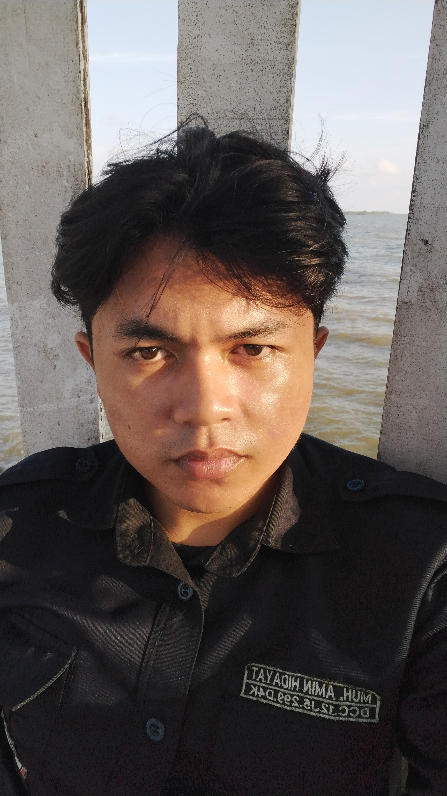

# 👨‍💻 Dayat — Machine Learning Engineer & Model Training

  
  <h3>Muhammad Hidayat</h3>
  
<em>Machine Learning Engineer & Computer Vision Specialist</em>

---

## 📌 Profil Singkat

| Informasi | Detail |
|:---|:---|
| **Peran di Tim** | Machine Learning Engineer & Model Training |
| **Institusi** | Universitas Dipa Makassar |
| **Organisasi / Study Club** | Dipa Computer Club (DCC) |
| **Website Organisasi** | [dcc-dp.id](https://dcc-dp.id) |

---

## 📖 Biografi

Mahasiswa teknik informatika di **Universitas Dipa Makassar** yang aktif berproses di **Dipa Computer Club (DCC)**. Memiliki ketertarikan mendalam pada bidang *Artificial Intelligence*, *Computer Vision*, dan *Deep Learning*. Bertanggung jawab atas perancangan arsitektur MobileNetV3-Small, proses augmentasi citra, hingga pelatihan dan evaluasi model klasifikasi kematangan sangrai biji kopi Toraja pada proyek Kopita.

---

## 💡 Kata Motivasi

> *"Teknologi terbaik bukan hanya tentang kecanggihan algoritma, tetapi tentang seberapa besar manfaat nyatanya dalam memajukan dan mensejahterakan masyarakat di sekitar kita."*

---

## 🌐 Hubungi Saya

- **GitHub**: [github.com/dayat-placeholder](https://github.com/dayattt111)
- **LinkedIn**: [linkedin.com/in/dayat-placeholder](https://linkedin.com/muhammad-amin-hidayat)
- **Instagram**: [@dayat_placeholder](https://instagram.com/ur.dayaa)
