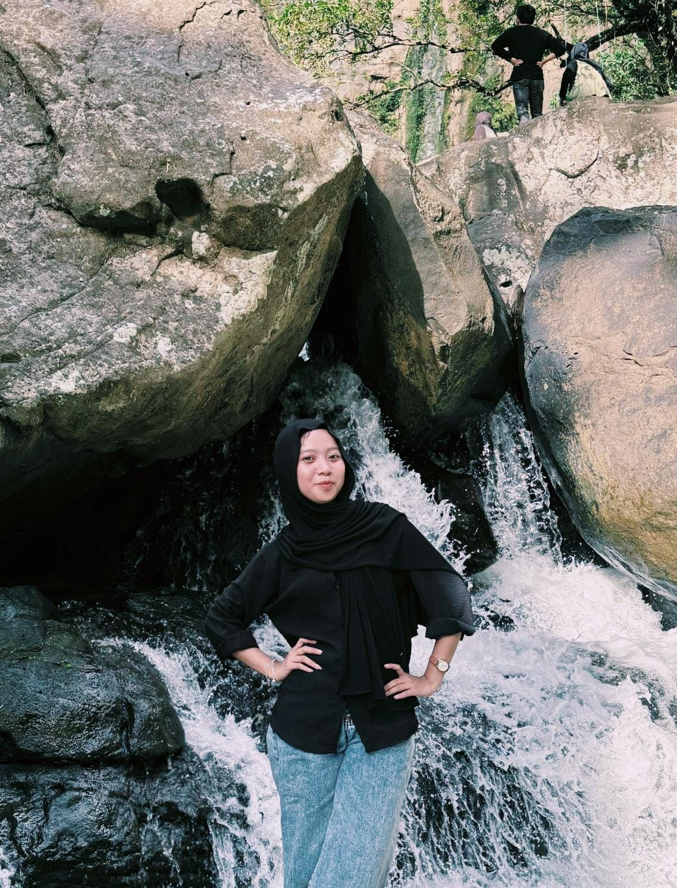

# ⚙️ Mull — Backend Developer & API Architecture

  
  <h3>Mull</h3>
  
<em>Backend Engineer & Systems Architect</em>

---

## 📌 Profil Singkat

| Informasi | Detail |
|:---|:---|
| **Peran di Tim** | Backend Developer & API Architecture |
| **Institusi** | Universitas Dipa Makassar |
| **Organisasi / Study Club** | Dipa Computer Club (DCC) |
| **Website Organisasi** | [dcc-dp.id](https://dcc-dp.id) |

---

## 📖 Biografi

Mahasiswa **Universitas Dipa Makassar** dan anggota aktif **Dipa Computer Club (DCC)** yang berfokus pada pengembangan backend performa tinggi, API modular, dan arsitektur sistem terdistribusi. Bertanggung jawab atas perancangan API Engine FastAPI Kopita, standarisasi pipeline sanitasi gambar Letterbox, serta integrasi kontainerisasi Docker yang aman dan terisolasi.

---

## 💡 Kata Motivasi

> *"Sistem yang andal dibangun dari baris kode yang sederhana, aman, dan dirancang untuk melayani kebutuhan nyata pengguna."*

---

## 🌐 Hubungi Saya

- **GitHub**: [github.com/mull-placeholder](https://github.com/)
- **LinkedIn**: [linkedin.com/in/mull-placeholder](https://linkedin.com/)
- **Instagram**: [@mull_placeholder](https://instagram.com/)
