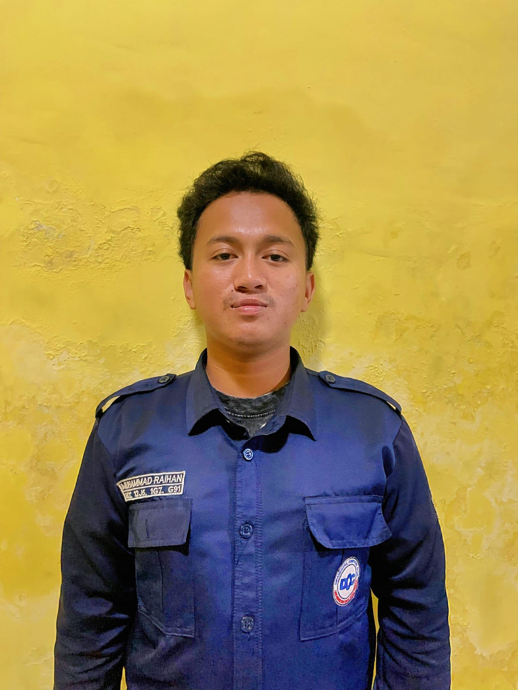

# 🎨 Rey — Frontend Developer & UI Systems

  
  <h3>Rey</h3>
  
<em>Frontend Developer & UI Systems Engineer</em>

---

## 📌 Profil Singkat

| Informasi | Detail |
|:---|:---|
| **Peran di Tim** | Frontend Developer & UI Systems |
| **Institusi** | Universitas Dipa Makassar |
| **Organisasi / Study Club** | Dipa Computer Club (DCC) |
| **Website Organisasi** | [dcc-dp.id](https://dcc-dp.id) |

---

## 📖 Biografi

Mahasiswa **Universitas Dipa Makassar** dan pengembang di **Dipa Computer Club (DCC)** yang berfokus pada rekayasa antarmuka pengguna modern dan interaktif. Bertanggung jawab atas perancangan desain portal Streamlit Kopita, integrasi palet warna *Warm Earthy Espresso*, standarisasi komponen kustom, serta penyelarasan responsivitas visual aplikasi.

---

## 💡 Kata Motivasi

> *"Desain yang hebat bukan sekadar bagaimana sesuatu terlihat, melainkan bagaimana antarmuka tersebut memudahkan dan memberi dampak positif bagi yang menggunakannya."*

---

## 🌐 Hubungi Saya

- **GitHub**: [github.com/rey-placeholder](https://github.com/)
- **LinkedIn**: [linkedin.com/in/rey-placeholder](https://linkedin.com/)
- **Instagram**: [@rey_placeholder](https://instagram.com/)