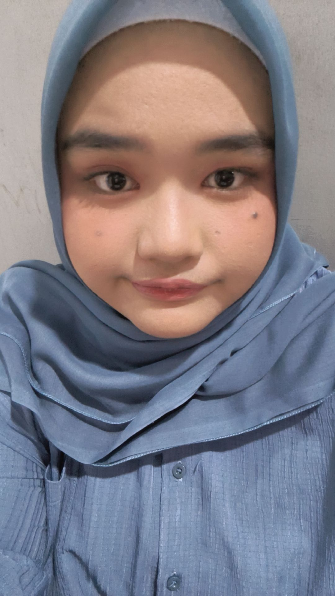

# 📊 Sasa — UI/UX Designer & Data Analyst

  
  <h3>Sasa</h3>
  
<em>UI/UX Designer & Product Data Analyst</em>

---

## 📌 Profil Singkat

| Informasi | Detail |
|:---|:---|
| **Peran di Tim** | UI/UX Designer & Data Analyst |
| **Institusi** | Universitas Dipa Makassar |
| **Organisasi / Study Club** | Dipa Computer Club (DCC) |
| **Website Organisasi** | [dcc-dp.id](https://dcc-dp.id) |

---

## 📖 Biografi

Mahasiswi **Universitas Dipa Makassar** dan anggota **Dipa Computer Club (DCC)** yang berfokus pada riset pengalaman pengguna (*user experience*) dan analisis data produk. Bertanggung jawab atas perancangan persona pengguna, studi kebutuhan UMKM Roastery kopi Toraja, kurasi narasi bisnis kopi, serta analisis evaluasi metrik akurasi model AI Kopita.

---

## 💡 Kata Motivasi

> *"Setiap data menyimpan cerita, dan setiap desain yang baik adalah jembatan yang menghubungkan teknologi rumit menjadi solusi sederhana bagi manusia."*

---

## 🌐 Hubungi Saya

- **GitHub**: [github.com/sasa-placeholder](https://github.com/)
- **LinkedIn**: [linkedin.com/in/sasa-placeholder](https://linkedin.com/)
- **Instagram**: [@sasa_placeholder](https://instagram.com/)